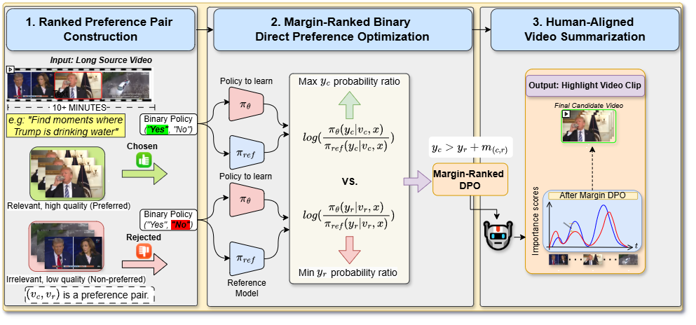

# VSLICE: Video Summarization via Margin-Ranked Binary Preference Optimization

VSLICE is a multimodal video summarization framework that aligns Vision-Language Models (VLMs) with human preference rankings using **Margin-Ranked Binary Preference Optimization**. By reformulating keyframe and highlight selection as a preference learning problem, VSLICE leverages pretrained visual-semantic reasoning in widely used open-sourced VLMs (such as MiniCPM-V, Qwen2.5-VL, and Moondream) to produce concise, representative video summaries.

---

## 📌 Table of Contents

- [Overview](#-overview)
- [Key Features](#-key-features)
- [Algorithmic Architecture](#-algorithmic-architecture-simple_dpopy)
  - [1. Visual-Text Framing & Logit Scoring](#1-visual-text-framing--logit-scoring)
  - [2. Preference Pair Mining & Ground-Truth Margins](#2-preference-pair-mining--ground-truth-margins)
  - [3. Preference Optimization Objectives](#3-reference-regularized-dpo-objectives)
  - [4. Differential Attention / Tanh Boost](#4-differential-attention--tanh-boost)
- [Benchmark Results](#-benchmark-results)
- [Installation & Environment](#-installation--environment)
- [Dataset Preparation](#-dataset-preparation)
- [Training & Evaluation](#-training--evaluation)
  - [CLI Arguments](#cli-arguments)
  - [Running on SumMe](#running-on-summe)
  - [Running on TVSum](#running-on-tvsum)

---

## 🔍 Overview

Traditional video summarization methods typically rely on supervised regression using mean squared error (MSE) or reinforcement learning agents to predict frame-level importance scores. However:
- Supervised MSE treats all errors uniformly without prioritizing relative ranking between key highlights and background clips.
- Standard vision backbones lack high-level semantic understanding of video themes and narrative relevance.

**VSLICE solves this by:**
1. Formulating importance scoring as a binary classification decision (*"Does this image show a key highlight from the video related to '{title}'?"*) queried to a Vision-Language Model.
2. Fine-tuning the VLM using **Margin-Ranked Binary Preference Optimization**, training the model to contrast high-importance clips (peaks) against low-importance clips (valleys).
3. Utilizing Parameter-Efficient Fine-Tuning (**PEFT / LoRA**) with 8-bit AdamW optimization, enabling fine-tuning of multi-billion parameter VLMs on consumer GPUs.

---

## ✨ Key Features

- **Multi-Backbone VLM Support**: Plug-and-play support for `MiniCPM-V-2_6` (and 4-bit quantized versions), `Qwen2.5-VL-3B/7B-Instruct`, and `Moondream2`.
- **Margin-Aware Preference Optimization**: Integrates continuous ground-truth score discrepancies into the DPO formulation to avoid treating marginal differences with equal importance.
- **Multiple Preference Loss Formulations**:
  - **DPO** (Direct Preference Optimization): Standard log-sigmoid margin objective.
  - **MPO** (Modulated / Focal Preference Optimization): Down-weights easy pairs and focuses gradient updates on borderline candidates.
- **Differential Logit Boosting**: Optional tanh-gated amplification layer (`diff_attn_boost`) that enhances subtle logit distinctions between target tokens.
- **Standardized Benchmark Evaluation**: 5-fold cross-validation supporting standard evaluation protocols on **SumMe** and **TVSum**, reporting F1-Score, Kendall's $\tau$, and Spearman's $\rho$.
- **Low Resource Efficiency**: Competitive inference peformance is supported on only NVIDIA RTX 3070 with 8GB memory.
---

## 🧠 Proposed Algorithm Methodology

The core algorithm is implemented in [`vslice/vslice_dpo.py`](vslice/vslice_dpo.py) (illustrated in the main figure below). The training and evaluation pipeline proceeds through five key stages:

<p align="center">
  
</p>

```
Video Dataset (SumMe / TVSum)
       │
       ▼
Preference Mining ──► Extract Peak Clips (Chosen) vs. Valley Clips (Rejected)
       │              Compute Log-Margin: log(y_c + ε) - log(y_r + ε)
       ▼
   VLM Passes:
   ├─► Frozen Reference Model  ──► ref_logp_c, ref_logp_r
   └─► Trainable Policy Model  ──► pi_logp_c,  pi_logp_r
       │
       ▼
Compute Implicit Reward:
   Δ = (pi_logp_c - pi_logp_r) - (ref_logp_c - ref_logp_r)
   z = β * (Δ - log_margin)
       │
       ▼
Optimization (DPO / MPO Loss) ──► Update LoRA
       │
       ▼
Inference & Dynamic Programming (Knapsack) ──► Summary Clips & Benchmark Metrics (F1, Tau, Rho)
```

### 1. Visual-Text Framing & Logit Scoring

Each sampled video frame $x$ is paired with a task prompt conditioned on the video title:
```
Prompt: "Does this image show a key highlight from the video titled '{title}'?"
System: "You are an expert video editor. Strictly answer only Yes or No."
```

The model produces logits for the next generated token. The binary importance score is derived from the difference between the target token logits (`"Yes"` and `"No"`):

$$\Delta z = z_\text{yes} - z_\text{no}$$

The frame-level predicted probability is:

$$\tilde{\pi}_\theta(y_{\text{yes}} \mid v, x) = \sigma\left(z_\text{yes} - z_\text{no}\right)$$

### 2. Preference Pair Mining & Ground-Truth Margins

To construct preference pairs from continuous ground-truth frame scores:
1. Each training video is partitioned into sub-clips of length $L$ (default: 4).
2. Sub-clips are sorted by their average ground-truth importance scores.
3. The top quantile represents **Chosen** highlight candidates (peaks), and the bottom quantile represents **Rejected** candidates (valleys).
4. Candidate pairs $(c, r)$ are retained only if the score gap exceeds a minimum threshold (optional).

### 3. Reference-Regularized DPO Objectives

During training, base parameters are frozen. Low-rank adapters are used for parameter-efficient fine-tuning.

1. **Reference Model**:
Frozen reference base model $\tilde{\pi}_{\text{ref}}(y \mid v, x)$.

2. **Policy Model**:
Policy model $\tilde{\pi}_\theta(y \mid v, x)$.

3. **Loss Formulations**:

- **Margin-Ranked Preference Optimization (Margin-DPO)**:

$$
\mathcal{L}_{\text{Margin-DPO}} = -\log \sigma \Bigg( \beta \bigg[ \left( \log \frac{\tilde{\pi}_\theta(y \mid v_c, x)}{\tilde{\pi}_{\text{ref}}(y \mid v_c, x)} \right) - \left( \log \frac{\tilde{\pi}_\theta(y \mid v_r, x)}{\tilde{\pi}_{\text{ref}}(y \mid v_r, x)} \right) - m_{c,r} \bigg] \Bigg)
$$

- **Modulated Preference Optimization (MPO)** (focal modulation):

$$
\mathcal{L}_{\text{MPO}} = -\Bigg(1 - \sigma \Bigg( \beta \bigg[ \left( \log \frac{\tilde{\pi}_\theta(y \mid v_c, x)}{\tilde{\pi}_{\text{ref}}(y \mid v_c, x)} \right) - \left( \log \frac{\tilde{\pi}_\theta(y \mid v_r, x)}{\tilde{\pi}_{\text{ref}}(y \mid v_r, x)} \right) - m_{c,r} \bigg] \Bigg)\Bigg)^2 \log \sigma \Bigg( \beta \bigg[ \left( \log \frac{\tilde{\pi}_\theta(y \mid v_c, x)}{\tilde{\pi}_{\text{ref}}(y \mid v_c, x)} \right) - \left( \log \frac{\tilde{\pi}_\theta(y \mid v_r, x)}{\tilde{\pi}_{\text{ref}}(y \mid v_r, x)} \right) - m_{c,r} \bigg] \Bigg)
$$

---

## ⚙️ Installation & Environment

### 1. Clone & Set Up Conda Environment

```bash
git clone https://github.com/dexterdley/VSLICE.git
cd VSLICE

conda env create -f environment.yml
conda activate VSLICE
```

### 2. Download Pretrained Multimodal Backbones

#### MiniCPM-V 2.6
Download the model weights into the repository root:
```bash
git lfs install
git clone https://huggingface.co/openbmb/MiniCPM-V-2_6-int4
```

#### Qwen2.5-VL / Moondream
Alternatively, Qwen2.5-VL or Moondream can be loaded directly from HuggingFace.

### 3. Dataset Preparation

Place the benchmark datasets and their raw videos in their corresponding directories:

```
VSLICE/
├── SumMe/
│   ├── eccv16_dataset_summe_google_pool5.h5
│   └── raw/videos/*.mp4
├── TVSum/
│   ├── eccv16_dataset_tvsum_google_pool5.h5
│   └── raw/ydata-tvsum50-v1_1/video/*.mp4
└── dataset/
    ├── summe_splits.json
    └── tvsum_splits.json
```

---

## 🚀 Training & Evaluation

The following are terminal commands and hyperparameter settings for training and evaluation.

### CLI Arguments

| Argument | Type | Default | Description |
| :--- | :--- | :--- | :--- |
| `--model_type` | `str` | `minicpm` | Vision-Language backbone (`minicpm`, `qwen2_vl_3b`, `qwen2_vl_7b`) |
| `--dataset` | `str` | `both` | Dataset name (`summe` or `tvsum`) |
| `--split_file` | `str` | `./dataset/summe_splits.json` | Path to JSON split definitions |
| `--loss_type` | `str` | `DPO` | Optimization loss: `DPO`, `IPO`, or `MPO` |
| `--beta` | `float` | `0.1` | DPO temperature / implicit reward scaling factor |
| `--clip_length` | `int` | `4` | Number of consecutive frames per sub-clip |
| `--batch_size` | `int` | `2` | Batch size (number of video clip pairs per step) |
| `--num_epochs` | `int` | `5` | Training epochs per split |
| `--learning_rate` | `float` | `1e-5` | Learning rate for 8-bit AdamW optimizer |
| `--use_boost` | `bool` | `False` | Enable differential attention tanh boost |
| `--output_dir` | `str` | `./checkpoints` | Checkpoint output folder for best LoRA weights |

### Running on SumMe

```bash
python vslice/simple_dpo.py \
    --dataset summe \
    --split_file ./dataset/summe_splits.json \
    --model_type minicpm \
    --batch_size 2 \
    --clip_length 4 \
    --num_epochs 5 \
    --beta 0.1 \
    --learning_rate 5e-5 \
    --loss_type DPO
```

### Running on TVSum

```bash
python vslice/simple_dpo.py \
    --dataset tvsum \
    --split_file ./dataset/tvsum_splits.json \
    --model_type minicpm \
    --batch_size 2 \
    --clip_length 4 \
    --num_epochs 3 \
    --beta 0.1 \
    --learning_rate 5e-5 \
    --loss_type DPO
```

---


## 📜 License

This project is licensed under the MIT License. See [LICENSE](LICENSE) for details.
